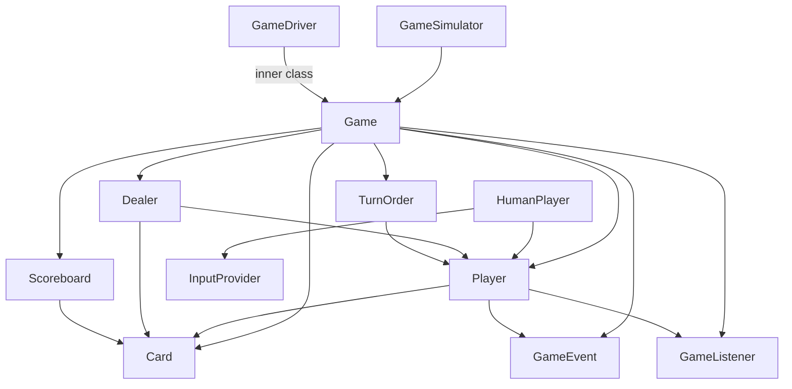
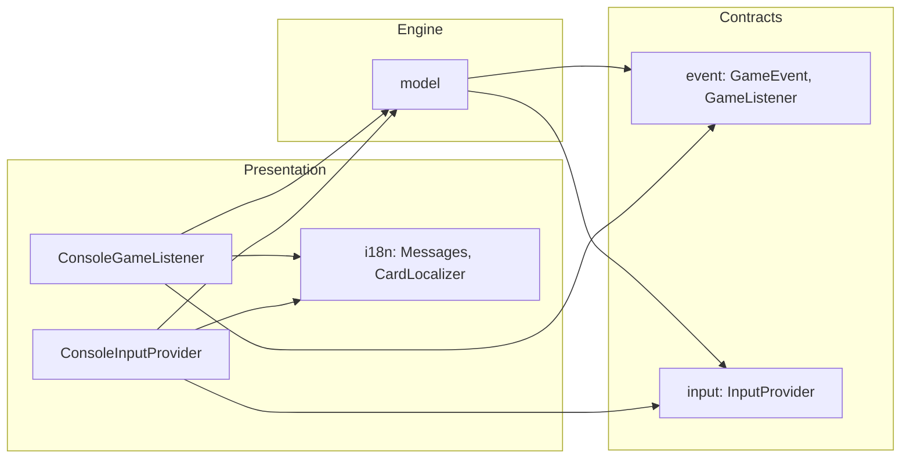
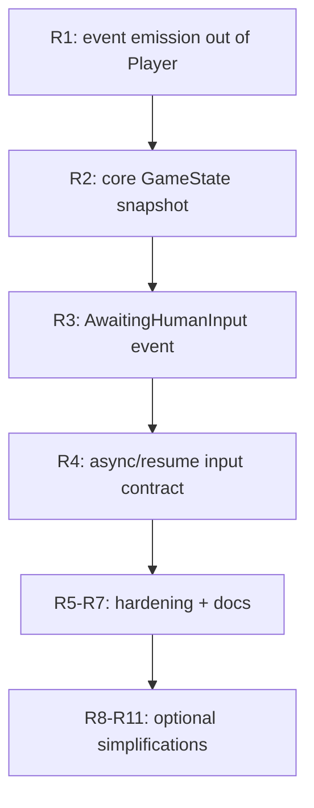

# Core Module Analysis — Trumpcards

> Scope: `core/` module (game engine, events, input contracts, i18n, console launcher).
> Goal: characterize the domain model, verify layer separation, verify the domain
> model is minimal/simple, and confirm readiness for **mobile / desktop / web** UI ports.
> Date: 2026-07-15

---

## 1. Module structure

The `core` module is a plain Java 21 + Lombok library (no UI framework dependency).
It contains four logical layers plus a console launcher:

| Layer | Package | Role |
|-------|---------|------|
| Domain / engine | `ru.anseranser.model` | Game rules, state, flow |
| Output contract + console impl | `ru.anseranser.event` | Events emitted by the engine, `GameListener` interface, `ConsoleGameListener`, `NopListener` |
| Input contract + console impl | `ru.anseranser.input` | `InputProvider` interface, `ConsoleInputProvider`, `NoopInputProvider` |
| Localization | `ru.anseranser.i18n` | `Messages`, `CardLocalizer` (presentation-agnostic) |
| Console launcher | `ru.anseranser.App` | Wires console listener + input, runs `playGame()` |

Build: [`core/build.gradle.kts`](core/build.gradle.kts) declares only `guava`, `lombok`, `junit`.
No Swing/JavaFX/LibGDX/Android dependency — the engine is framework-free. Good.

---

## 2. Domain model characterization

### 2.1 Entities

- **`Card`** ([`Card.java`](core/src/main/java/ru/anseranser/model/Card.java)) — a `record`
  of `Suit` (SPADES/CLUBS/DIAMONDS/HEARTS) and `Rank` (SIX..ACE with an `int value`).
  Pure immutable value object. **Zero dependencies.** This is the ideal domain primitive.

- **`Scoreboard`** ([`Scoreboard.java`](core/src/main/java/ru/anseranser/model/Scoreboard.java)) —
  per-suit `Deque<Card>` "ladders" (one per suit). Pure data + rules: `init`, `nextRequiredRank`,
  `pushAndEliminates`, `snapshot`. Depends only on `Card`. No I/O, no player references. Clean.

- **`TurnOrder`** ([`TurnOrder.java`](core/src/main/java/ru/anseranser/model/TurnOrder.java)) —
  fixed circular seating of `Player`s with `next` / `nextActive` navigational helpers.
  Depends only on `Player`. Deterministic (no random anchor). Clean.

- **`Dealer`** ([`Dealer.java`](core/src/main/java/ru/anseranser/model/Dealer.java)) —
  builds the 36-card deck, shuffles with an injected `Random`, deals round-robin to active
  players. Depends on `Card` and `Player` (mutates `player.getHand()`). Clean and testable.

- **`Player`** ([`Player.java`](core/src/main/java/ru/anseranser/model/Player.java)) —
  holds `trump` (suit), `hand` (`List<Card>`), `gamer` flag, and a `GameListener`.
  Contains the **move mechanic** (`makeMove`, `canBeat`, `weakestDefense`, `chooseLeadCard`,
  `playLeadCard`, `takePot`, `beatCard`) and **emits events** (`CardPlayed`, `CardBeaten`,
  `PotTaken`). This is the only entity that reaches outside the pure domain (see §4).

- **`HumanPlayer extends Player`** ([`HumanPlayer.java`](core/src/main/java/ru/anseranser/model/HumanPlayer.java)) —
  overrides only the two decision hooks (`playLeadCard`, `chooseDefenseCard`) to ask an
  `InputProvider` instead of applying the AI heuristic. Shares `makeMove` via inheritance.

- **`Game`** ([`Game.java`](core/src/main/java/ru/anseranser/model/Game.java)) — the orchestrator.
  Owns `TurnOrder`, `Dealer`, `Scoreboard`, the `pot`, the `dealerSeat`, the `listener`, and the
  `Random`. Contains round setup, obligatory-card exchange, loser determination, elimination,
  dealer advance, and the nested **`GameDriver`** ([`Game.java:337`](core/src/main/java/ru/anseranser/model/Game.java:337))
  for stepwise play. Largest class (~417 lines).

- **`GameSimulator`** ([`GameSimulator.java`](core/src/main/java/ru/anseranser/model/GameSimulator.java)) —
  a verification harness that replays many seeded games and asserts invariants
  (card conservation, single winner, termination, determinism).

### 2.2 Inferred game rules

Four seats, one per fixed trump suit. A 36-card deck (6..ACE). Each suit has a "scoreboard
ladder" seeded with its SIX. Players must pass the next-required rank upward to the suit's owner
(`distributeObligatoryCards`). A round deals the deck, then plays tricks: lead a card, beat it or
take the pot. The round loser pushes their lowest remaining trump onto their ladder; if that card
is an ACE the ladder is complete and the player is **eliminated**. The last remaining `gamer` wins.
This is a custom "trump-ladder elimination" game, not a standard deck game.

### 2.3 Dependency graph (current)

---

## 3. Layer separation analysis

### 3.1 Direction of dependencies

The engine (`model`) depends on the **contracts** `GameListener` / `GameEvent` (in `event`) and
`InputProvider` / `NoopInputProvider` (in `input`). It does **not** depend on the console
implementations (`ConsoleGameListener`, `ConsoleInputProvider`). The console implementations depend
on `model` + `event` + `input` + `i18n`. This is correct **dependency inversion**: the engine
defines the seams, the presentation layer supplies the implementations.

### 3.2 Verdict on separation

- **Engine ↔ Output:** well separated. The engine never formats or prints text; it emits
  `GameEvent`s. `ConsoleGameListener` is the only place that turns data into text, and it was
  moved out of the model in "Stage 1". ✅
- **Engine ↔ Input:** well separated. `HumanPlayer` asks an `InputProvider` rather than reading
  `Scanner`. `NoopInputProvider` lets AI-only games run headless. ✅
- **i18n:** correctly isolated in its own package, presentation-agnostic, reusable by every UI. ✅
- **Console launcher (`App`)** lives in `core`. This is a deliberate choice (per
  [`settings.gradle.kts`](settings.gradle.kts)) — core = engine + console. Acceptable, but see R9.

**Conclusion:** the three layers (engine / input / output) are carefully separated. The contracts
are stable and the console is just one implementation among (future) many.

---

## 4. Is the domain model minimal / simplest?

The user explicitly asked to verify the domain model is implemented in the **simplest way with the
minimum of connections between entities**. Assessment:

| Entity | Connections | Minimal? |
|--------|-------------|----------|
| `Card` | none | ✅ ideal |
| `Scoreboard` | `Card` only | ✅ |
| `TurnOrder` | `Player` only | ✅ |
| `Dealer` | `Card`, `Player` (hand mutation) | ✅ |
| `Player` | `Card`, `DecisionStrategy` | ✅ (was ⚠ — events moved to `Game`/`GameDriver`, see R1) |
| `HumanPlayer` | *removed* — replaced by `HumanDecisionStrategy` (R8) | ✅ |
| `Game` | `TurnOrder`, `Dealer`, `Scoreboard`, `Player`, `Card`, `GameEvent`, `GameListener`, `Rng` | ✅ expected for orchestrator |
| `GameDriver` | `Game` private state (inner class) | ✅ intentional |

### Issues that violate "minimal connections"

1. **`Player` emits events (coupling to the event system).** — ✅ **RESOLVED (R1).**
   `Player` no longer holds a `GameListener` and no longer fires events. Event emission was moved up
   into `Game` / `GameDriver`, which own the listener and emit `CardPlayed` / `CardBeaten` /
   `PotTaken` / `AwaitingHumanInput` from the orchestrator layer. `Player` is now a pure domain
   object.

2. **`HumanPlayer extends Player` (inheritance coupling).** — ✅ **RESOLVED (R8).**
   The `HumanPlayer` subclass was removed. A `DecisionStrategy` (AI vs Human) is injected into
   `Player`, eliminating the subclass and the `input` dependency from the domain entirely.

3. **`Game` instantiates `Dealer` / `Scoreboard` directly** ([`Game.java:27`](core/src/main/java/ru/anseranser/model/Game.java:27),
   [`Game.java:33`](core/src/main/java/ru/anseranser/model/Game.java:33)). Minor — fine for
   simplicity, but constructor injection would make the orchestrator fully decoupled and testable
   without its collaborators' internals. *Left as-is intentionally — simplicity over decoupling for
   these leaf collaborators.*

**Verdict:** the model is now **simple and well-factored** (the leaf entities are excellent, and
`Player` is a pure domain object). All deviations from the "minimal connections" target the user
described have been resolved.

---

## 5. Readiness for mobile / desktop / web UI ports

### 5.1 What is already good

- Event-based output (`GameListener`) — any UI can render from events. ✅
- Input abstraction (`InputProvider`) — any UI supplies its own source of choices. ✅
- `i18n` separated and reusable. ✅
- **`GameDriver`** stepwise API ([`Game.java:337`](core/src/main/java/ru/anseranser/model/Game.java:337))
  lets a UI advance one move at a time and animate between moves. ✅
- **Deterministic** with an injected `Rng` (custom `SplitMix64`, single `long` state) — replayable,
  testable, and portable to Android / GraalVM / web (no JDK-reflection hacks). ✅
- Console implementations are isolated classes, not baked into the engine. ✅
- `core` has **no UI-framework dependency** — it compiles for any JVM target. ✅

### 5.2 Gaps that block a clean port

| # | Gap | Impact on mobile / desktop / web | Severity | Status |
|---|-----|----------------------------------|----------|--------|
| G1 | **Synchronous blocking input.** `InputProvider.chooseLeadCard/chooseDefense` block until a card is returned. | Desktop: OK. Mobile: OK with a background thread. Web: poor fit. | High | ✅ **RESOLVED (R4)** — `GameDriver` now yields on `AwaitingHumanInput` and resumes via `resume(Card)`; the blocking `InputProvider` is only one of several strategies. |
| G2 | **No "human turn / awaiting input" event.** | Every UI must re-invent this workaround. | High | ✅ **RESOLVED (R3)** — `AwaitingHumanInput` event emitted by `GameDriver` before the human move. |
| G3 | **No core-level immutable snapshot.** `GameSnapshot` lived in `desktop-libgdx`, not in `core`. | Mobile/web would each duplicate snapshot logic. | High | ✅ **RESOLVED (R2)** — `GameState` now lives in `core` (`ru.anseranser.model.GameState`), built by `Game`, returning unmodifiable collections. |
| G4 | **Not thread-safe by contract.** | Web (multiple sessions) and concurrent access need an explicit contract. | Medium | ✅ **RESOLVED (R7)** — thread-safety contract documented: single engine thread mutates `Game`; read only via `GameState`. |
| G5 | **`Player.getHand()` returns the mutable list.** | A careless UI could mutate domain state. | Medium | ✅ **RESOLVED (R5)** — all state getters return unmodifiable views (`List.copyOf` / `Map.copyOf`). |
| G6 | **Human player created inside `Game` via a `boolean` flag.** | Multi-platform config hardcoded. | Low | ✅ **RESOLVED (R6)** — human seat injected via `DecisionStrategy`; `Game` no longer takes a boolean. |
| G7 | **No save/restore (serialization) of game state.** | Mobile/web persistence not supported mid-game. | Medium | ✅ **RESOLVED (R10)** — `SavedGame` (Gson) + portable `SplitMix64` RNG state. |
| G8 | **Events carry `Player` references.** | A UI could accidentally mutate a domain object. | Low | ✅ **RESOLVED (R11)** — events now carry player IDs (trump suit) instead of `Player` references. |

### 5.3 Readiness verdict

The `core` module is **fully ready** for desktop (proven by `desktop-libgdx`), mobile (same
JVM/background-thread pattern), and **web**. All eight gaps (G1–G8) have been resolved: the engine
yields on `AwaitingHumanInput` and resumes via `resume(Card)` (no blocking on the event loop), the
immutable `GameState` snapshot is in `core`, the thread-safety contract is documented, getters
return unmodifiable views, the human seat is injected, save/restore works with a portable PRNG, and
events carry IDs not `Player` references. A web module can now be built directly against `core`
without workarounds.

---

## 6. Refactoring suggestions

Prioritized. P0 = required for a clean multi-UI (especially web) port; P1 = readiness hardening;
P2 = nice-to-have simplification.

### P0 — enable clean UI ports

- **R1 — Move event emission out of `Player` into `Game`/`GameDriver`.** *Status: ✅ DONE.*
  `Player` is now a pure domain object; `Game`/`GameDriver` own the listener and emit
  `CardPlayed` / `CardBeaten` / `PotTaken` based on move results. Removes the `Player → event`
  connection (§4 issue #1) and makes the domain model pure.

- **R2 — Add a core-level immutable `GameState` / `Snapshot`.** *Status: ✅ DONE.*
  `ru.anseranser.model.GameState` lives in `core`, built by `Game`, returning **unmodifiable**
  collections. All UIs consume it instead of poking `Game` getters. Kills G3, partially G5.

- **R3 — Add an explicit `AwaitingHumanInput` event.** *Status: ✅ DONE.*
  Emitted by `GameDriver` right before calling the human's `makeMove`. Kills G2; UIs no longer need
  the `repaintHook` hack.

### P1 — readiness hardening

- **R4 — Make input async-friendly.** *Status: ✅ DONE.*
  `GameDriver` yields on `AwaitingHumanInput` and resumes via `driver.resume(chosenCard)` — the
  most web-friendly option (b). Resolves G1.

- **R5 — Return unmodifiable views** from all state getters. *Status: ✅ DONE.*
  `Player.getHand`, `Game.getPot`, `Game.getScoreboard` (via `snapshot()`) all return unmodifiable
  collections. Resolves G5.

- **R6 — Inject the human player** instead of the `humanPlayer` boolean in `Game`. *Status: ✅ DONE.*
  The composing UI decides which seat (if any) is human via a `DecisionStrategy`. Resolves G6.

- **R7 — Document the thread-safety contract.** *Status: ✅ DONE.*
  Single game instance is mutated from one engine thread; read it only via `GameState` captured on
  that thread. Resolves G4 ambiguity for web/server use.

### P2 — nice-to-have simplification

- **R8 — Replace `HumanPlayer` inheritance with a `DecisionStrategy`.** *Status: ✅ DONE.*
  `HumanPlayer` removed; a `DecisionStrategy` (AI vs Human) is injected into `Player`. Removes the
  subclass and the `input` dependency from the domain. Resolves §4 issue #2.

- **R9 — Extract the console launcher into its own `console` platform module.** *Status: ✅ DONE.*
  `console` module mirrors `desktop-libgdx`; `core` is now a pure engine with no launcher. Stricter
  separation.

- **R10 — Add game-state serialization** (save/restore) for mobile/web persistence. *Status: ✅ DONE.*
  *Benefit:* resolves G7. Implemented via `SavedGame` (Gson, custom null-safe `CardAdapter`) plus a
  portable PRNG. **`java.util.Random` was replaced by a custom `Rng` interface + `SplitMix64`
  implementation** (single `long` state, fully serializable, no reflection, portable to Android /
  GraalVM / web). `Game.save()` captures `rng.getState()`; `Game.restore()` rebuilds the RNG via
  `setState(...)`. Covered by `GameSerializationTest`.

- **R11 — Use player IDs (not `Player` references) in event payloads.** *Status: ✅ DONE.*
  Events now carry player IDs (trump suit) instead of `Player` references. Resolves G8, prevents
  accidental domain mutation from the view layer.

---

## 7. Recommended sequence

R1 → R2 → R3 are the minimum to call `core` "fully ready" for mobile, desktop, and web. R4 makes
the web port straightforward rather than a workaround.

---

## 8. Summary

> **Status (post-refactor):** All recommendations **R1–R11 are implemented and verified** — `core`
> tests pass and both platform modules (`console`, `desktop-libgdx`) compile against the refactored
> engine. The module is now **fully ready** for mobile, desktop, and web UI ports.

- **Domain model:** simple and well-factored. Leaf entities (`Card`, `Scoreboard`, `TurnOrder`,
  `Dealer`) are excellent. `Game` is a necessary orchestrator. `Player` is now a pure domain object
  — it no longer emits events (R1) and no longer depends on `InputProvider`/`HumanPlayer` (R8); it
  holds only `Card` + a `DecisionStrategy`. The `HumanPlayer` subclass was removed entirely.
- **Layer separation:** strong. Engine depends only on input/output *contracts*
  (`GameListener`, `GameEvent`, `InputProvider`, `DecisionStrategy`, `Rng`), never on any console /
  desktop / web implementation. i18n is isolated. The console launcher was extracted into its own
  `console` module (R9), leaving `core` as a pure, UI-framework-free engine.
- **UI readiness:** ready for **desktop** (proven), **mobile** (same JVM pattern), and **web**. The
  web blockers are resolved: async/resume input contract (R4) + `AwaitingHumanInput` event (R3)
  remove synchronous blocking; the immutable `GameState` snapshot (R2) gives the view a safe,
  thread-confined read model; serialization (R10) with a portable `SplitMix64` PRNG enables
  save/restore on any target (Android / GraalVM / web — no JDK-reflection hacks).
- **Top 3 actions (all done):** R1 (pure `Player`), R2 (core `GameState`), R3 (await-input event).
  These directly satisfied the user's two explicit requirements — minimal domain connections and
  full multi-UI readiness.
