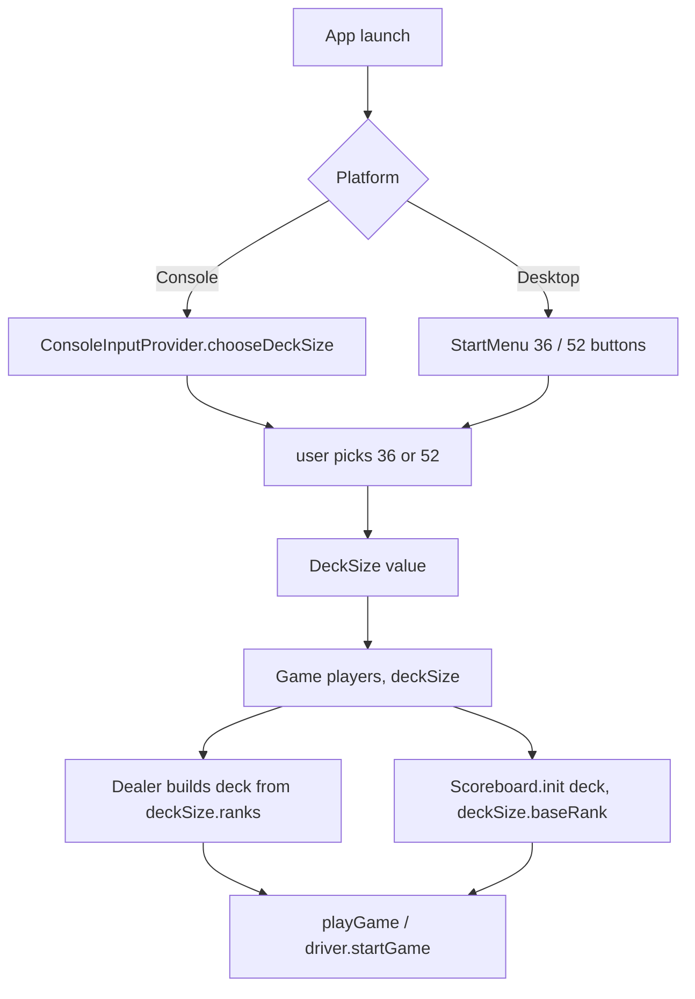
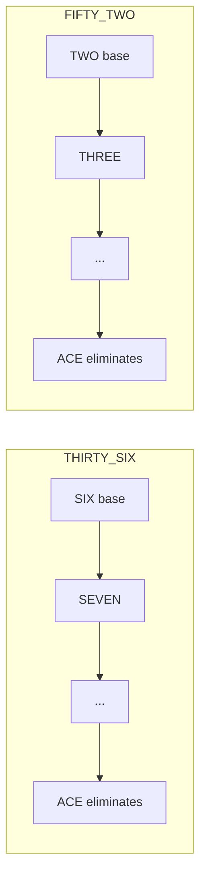
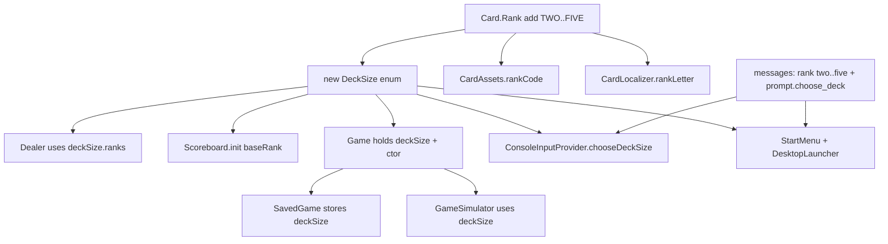

# Plan: Deck-size selection (36 / 52) at game launch

## Goal
Give the player a choice at game launch: play with a **36-card** deck (current
behaviour) or a **52-card** deck. When the 52-card deck is chosen, the
scoreboard ladders start from the **TWO** (the new lowest rank) instead of the
SIX. All other game rules stay unchanged.

The change is designed to touch every module (core model, i18n, console,
desktop) while keeping the existing 36-card behaviour as the default so current
tests keep passing.

---

## Core idea: one enum drives the whole feature

A new `DeckSize` enum carries two facts that differ between the two modes:

| Mode         | Cards | Scoreboard base | Ranks in deck        |
|--------------|-------|-----------------|----------------------|
| THIRTY_SIX  | 36    | SIX             | SIX .. ACE (9)       |
| FIFTY_TWO   | 52    | TWO             | TWO .. ACE (13)      |

`Card.Rank` is extended with `TWO(2), THREE(3), FOUR(4), FIVE(5)` placed
**before** `SIX` so the enum ordinal order is `TWO < ... < ACE`. The scoreboard
ladder logic already advances by `ordinal() + 1` (`Scoreboard.nextRequiredRank`),
so once the base card is TWO the ladder automatically runs TWO→ACE with **no
extra rule code**. The only model change is *which* base rank is seeded and
*which* ranks are dealt.

---

## Module-by-module changes

### 1. `core` — `model/Card.java`
Add four ranks to the `Rank` enum, keeping `getValue()` numeric (2..14):
```java
TWO(2), THREE(3), FOUR(4), FIVE(5),
SIX(6), SEVEN(7), EIGHT(8), NINE(9), TEN(10),
JACK(11), QUEEN(12), KING(13), ACE(14);
```
Nothing else in `Card` changes. `Player.canBeat` / `validDefenses` / `endRound`
all compare `getValue()`, so they are unaffected.

### 2. `core` — NEW `model/DeckSize.java`
```java
public enum DeckSize {
    THIRTY_SIX(36, Card.Rank.SIX),
    FIFTY_TWO(52, Card.Rank.TWO);

    private final int cardCount;
    private final Card.Rank baseRank;          // scoreboard base card
    public int cardCount() { return cardCount; }
    public Card.Rank baseRank() { return baseRank; }
    public List<Card.Rank> ranks() {           // baseRank .. ACE, ascending
        Card.Rank[] all = Card.Rank.values();
        return Arrays.asList(all).subList(baseRank.ordinal(), all.length);
    }
}
```

### 3. `core` — `model/Dealer.java`
- `Dealer(DeckSize deckSize)` builds the deck from `deckSize.ranks() × suits`.
- Keep `Dealer()` delegating to `Dealer(DeckSize.THIRTY_SIX)` (existing tests
  using `new Dealer()` keep working).

### 4. `core` — `model/Scoreboard.java`
- `init(List<Card> deck, Card.Rank baseRank)` — extract `baseRank` instead of
  the hardcoded `SIX`. `nextRequiredRank` / `pushAndEliminates` need **no**
  change (ordinal-based ladder).

### 5. `core` — `model/Game.java`
- Add `private final DeckSize deckSize;` and make `dealer` a constructor-assigned
  field (`new Dealer(deckSize)`).
- New primary constructor `Game(List<Player> players, DeckSize deckSize)` that
  calls `scoreboard.init(dealer.deck(), deckSize.baseRank())`.
- Keep `Game()`, `Game(List<Player>)`, `Game(DeckSize)` delegating to the new
  one with `THIRTY_SIX` where omitted (backward compatible for existing tests).

### 6. `core` — `model/SavedGame.java` + `Game.restore`
- Add `DeckSize deckSize` to the `SavedGame` record (Gson serializes enums by
  name). `GameDriver.save()` passes `Game.this.deckSize`.
- `Game.restore(...)` builds `new Game(players, saved.deckSize())` so a resumed
  game keeps the correct deck.

### 7. `core` — `model/GameSimulator.java`
- Accept a `DeckSize` (default `THIRTY_SIX`). `runOne` uses
  `new Game(players, deckSize)`.
- `Result` gains `expectedCards`; `invariantsHold()` checks
  `totalCards == expectedCards && distinctCards == expectedCards && activeGamers == 1`
  (replaces the hardcoded `36`).

### 8. `core` — i18n
- `messages.properties`, `messages_en.properties`, `messages_ru.properties`:
  add `card.rank.two/three/four/five` (+ `.short` = 2/3/4/5) and
  `prompt.choose_deck` (e.g. `Choose deck size: 1) 36 cards, 2) 52 cards: `).
- `CardLocalizer.rankLetter` switch: add `TWO->"2"`, `THREE->"3"`,
  `FOUR->"4"`, `FIVE->"5"`. `rankName`/`rankShort` already read from the
  bundle, so they pick up the new ranks automatically.

### 9. `console` — `ConsoleInputProvider` + `ConsoleLauncher`
- Add `DeckSize chooseDeckSize()` to `ConsoleInputProvider` (prints
  `prompt.choose_deck`, reads 1/2, reuses `readChoice`/`prompt.invalid`).
- `ConsoleLauncher.main` calls `input.chooseDeckSize()` first, then builds the
  players and `new Game(players, deckSize)`.

### 10. `desktop-libgdx` — `StartMenu` + `DesktopLauncher` + `CardAssets`
- NEW `StartMenu` (a LibGDX `Table` with two `TextButton`s "36" / "52" and a
  `Consumer<DeckSize>` callback). Shown by the launcher before the engine starts.
- `DesktopLauncher.create()` is restructured: build skin/assets/input/screen,
  show `StartMenu`; on selection it builds the players, `new Game(players,
  deckSize)`, wires the listener, and starts the game thread.
- `CardAssets.rankCode` switch: add `TWO->"2"`, `THREE->"3"`, `FOUR->"4"`,
  `FIVE->"5"`. The PNG assets for 2–5 of every suit already exist under
  `cards/base1/...`, so no new image files are needed.
- `GameScreen` needs no logic change: it already renders the top card of each
  scoreboard stack, which will now be the TWO for a 52-card game. (Optional:
  show deck size in the status line.)

---

## Diagrams

### Launch & deck construction flow


### Scoreboard ladder (the only behavioural difference)


### Module change map


---

## Tests to update / add
- `DealerTest`: pass `baseRank` to `sb.init(...)`; add `deckHasFiftyTwoUniqueCards`
  (`new Dealer(DeckSize.FIFTY_TWO)` → 52 cards, 48 dealt after base removal).
- `ScoreboardTest`: pass `Card.Rank.SIX` to `init`; add a 52-deck test asserting
  the base is TWO and the ladder runs TWO→ACE.
- `GameSimulatorTest`: use the new `DeckSize` API and assert against
  `expectedCards` (36 and a new 52 run).
- `GameSerializationTest`: add a check that `deckSize` round-trips through JSON
  and a 52-deck save/resume keeps the same winner + card count.
- `GameTest` / `GameDriverTest` / `GameStateTest` / `HumanPlayerStage1Test`
  keep using `new Game()` (defaults to THIRTY_SIX) so they stay green; only
  review them for any direct `new Dealer()` / `init` calls.

## Verification
- `./gradlew :core:test :console:test :desktop-libgdx:test` green for both
  deck sizes.
- Manual: console prompts for size; desktop shows the menu; a 52-card game
  shows TWOs at the base of every scoreboard ladder and plays to a single winner.
